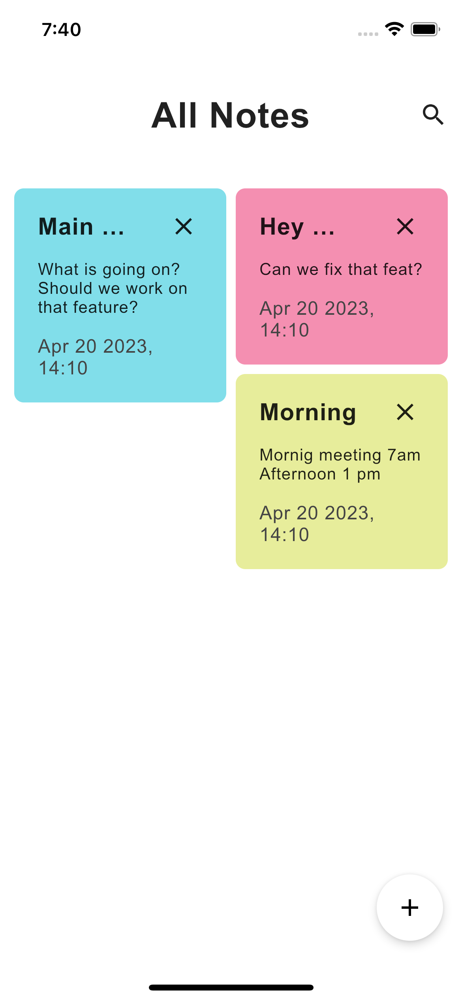
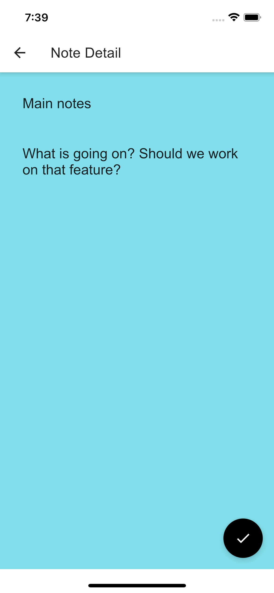

# Notes App
Simple Notes app built using 100% shared UI code with Jetpack Compose, SQL Delight to store
data and Decompose + Essenty to manage navigation.

## Compose Template
Used the compose template from [Compose Multiplatform Wizard](https://terrakok.github.io/Compose-Multiplatform-Wizard/)
Thanks to them, project setup was considerably easier.
Also large help from xxFast's [Krouter library](https://github.com/xxfast/KRouter)

## Before running!
 - check your system with [KDoctor](https://github.com/Kotlin/kdoctor)
 - install JDK 8 on your machine
 - add `local.properties` file to the project root and set a path to Android SDK there
 - run `./gradlew podInstall` in the project root

### To build the SQL Delight Kotlin bindings
Don't rebuild the project
<br><br>
<image src="https://media.giphy.com/media/g79am6uuZJKSc/giphy.gif" />

Instead just run only the sqldelight tasks from the gradle tab 
 -  generateCommonMainNotesDBInterface
 - generateSqlDelightInterface <br>
(Can also run the verify tasks for good measure.)

### Android
To run the application on android device/emulator:  
 - open project in Android Studio and run imported android run configuration

To build the application bundle:
 - run `./gradlew :composeApp:assembleDebug`
 - find `.apk` file in `composeApp/build/outputs/apk/debug/composeApp-debug.apk`

### Desktop
Run the desktop application: `./gradlew :composeApp:run`

### iOS
To run the application on iPhone device/simulator:
 - Add linker flags for SQL delight as `-lsqlite3` in Xcode under other linker flags. (Only if sqlite error shows)
 - Open `iosApp/iosApp.xcworkspace` in Xcode and run standard configuration.
 - Or can also be run using the KMM Jetbrains plugin that can be readily downloaded from the plugins marketplace.
## 🏗️️ Built with ❤️ using Kotlin
| What            | How                                                                       |
|-----------------|---------------------------------------------------------------------------|
| 🎭 All UI       | [Jetbrains Compose](https://github.com/JetBrains/compose-multiplatform)   |
| 💉 DI           | [Koin](https://insert-koin.io/)                                           |
| 🧭 Navigation   | [Decompose](https://github.com/arkivanov/Decompose)                       |
| ð Storage       | [SqlDelight](https://github.com/russhwolf/multiplatform-settings)         |
<p align="right">[<a href="#top">Back to top</a>]</p>


## Screenshots

### Android

<table style="width:100%">
  <tr>
    <th>Note List Screen</th>
    <th>Note Details Screen</th>
  </tr>
  <tr>
    <td></td>
    <td></td>
  </tr>
</table>

### iOS

<table style="width:100%">
  <tr>
    <th>Note List Screen</th>
    <th>Note Details Screen</th>
  </tr>
  <tr>
    <td></td>
    <td></td>
  </tr>
</table>

### 🤝 Contributors
[](https://github.com/kamathis4/NotesAppKMM/graphs/contributors)

### 💬 Want to discuss?

Have any questions, doubts or want to present your opinions, views? You're always welcome.

### Find this project useful ?

Support it by clicking the ⭐️ button on the upper right of this page.

### License

```
MIT License

Copyright (c) 2023 Adithya Kamath

Permission is hereby granted, free of charge, to any person obtaining a copy of this software and associated 
documentation files (the "Software"), to deal in the Software without restriction, including without limitation 
the rights to use, copy, modify, merge, publish, distribute, sublicense, and/or sell copies of the Software, and 
to permit persons to whom the Software is furnished to do so, subject to the following conditions:

The above copyright notice and this permission notice shall be included in all copies or substantial 
portions of the Software.

THE SOFTWARE IS PROVIDED "AS IS", WITHOUT WARRANTY OF ANY KIND, EXPRESS OR IMPLIED, INCLUDING BUT NOT LIMITED TO 
THE WARRANTIES OF MERCHANTABILITY, FITNESS FOR A PARTICULAR PURPOSE AND NONINFRINGEMENT. IN NO EVENT SHALL THE 
AUTHORS OR COPYRIGHT HOLDERS BE LIABLE FOR ANY CLAIM, DAMAGES OR OTHER LIABILITY, WHETHER IN AN ACTION OF CONTRACT, 
TORT OR OTHERWISE, ARISING FROM, OUT OF OR IN CONNECTION WITH THE SOFTWARE OR THE USE OR OTHER DEALINGS IN THE SOFTWARE.
```
